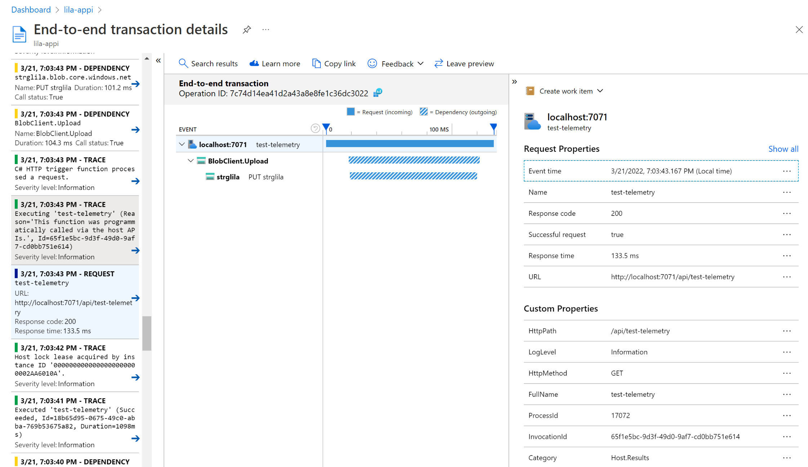
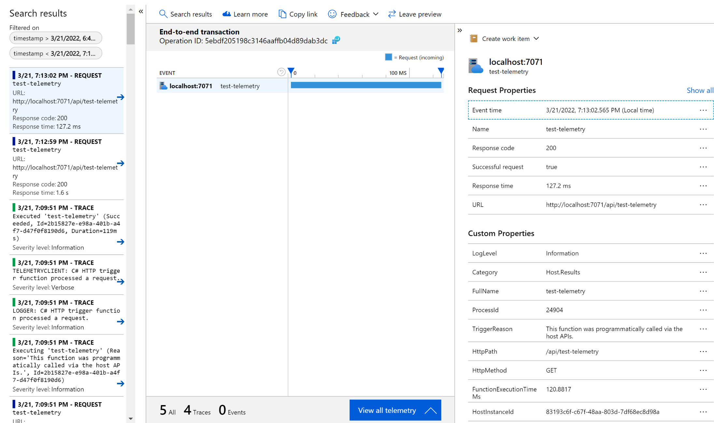

# Overview

It has been observed that when the `Microsoft.Azure.WebJobs.Logging.ApplicationInsights` package is added to a dotnet Azure Function project, the telemetry for Azure resource dependencies (e.g., Blob storage, Event Hub, Service Bus) is no longer captured.

The goal of this repo is to provide an easy way to reproduce this issue.

## Prerequisites

This sample solution was implemented using:

- .NET core 3.1
- Azure Function Core Tools (version 3.0.3904)
- An Application Insights instance in Azure
- An Azure Blob Storage Account (& a container named `telemetry`)

## Steps to reproduce

1. Clone the repo

2. Configure your local.settings.json

    ```bash
    # Create you local.settings.json file
    cp sample.local.settings.json local.settings.json
    ```

    Populate the following values with your own connection strings:

    - "APPLICATIONINSIGHTS_CONNECTION_STRING": ""
    - "BLOB_STORAGE_CONNECTION_STRING": ""


3. Run the app

    ```bash
    func start
    ```

4. Check Application Insights using `Transaction search` on the navigation menu

    Your application should run successfully and the telemetry captured in your AppInsights instance should look like this:

    

5. Add package `Microsoft.Azure.WebJobs.Logging.ApplicationInsights` to your project

    ```bash
    dotnet add package Microsoft.Azure.WebJobs.Logging.ApplicationInsights
    ```

    Optionally, you can uncomment the commented code in `test-telemetry.cs`, but this is not required.

6. Check Application Insights again

    **Expected results**

    The expected results are to get telemetry identical to the one from step 4.

    **Actual results**

    The telemetry captured in your AppInsights instance is missing the call to Blob Storage:

    
